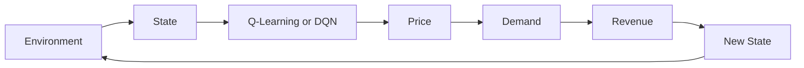

# RL Ticket Pricing

**Reinforcement learning agents that learn how to price event tickets over time to maximize revenue.**

The project builds a small simulated ticket market and trains two agents to set prices day by day: a from-scratch tabular **Q-learning** agent and a **Deep Q-Network (DQN)** built with TensorFlow/Keras. The two are then compared under identical conditions.

Stack: **Python · NumPy · Pandas · Gymnasium · TensorFlow/Keras · Plotly · Streamlit · pytest**

---

## The idea

Ticket sellers face a trade-off every day before an event:

- Price too high, and demand drops so seats go unsold.
- Price too low, and inventory sells out early, leaving revenue on the table.

The best price depends on how many tickets are left and how much time remains. That makes this a sequential decision problem under uncertainty, which is a natural fit for reinforcement learning.

## System diagram




Each day the agent observes the market, chooses a ticket price, customers respond (with randomness), revenue is collected, and the season continues until tickets sell out or the event date arrives.

---


## How to run

```bash
cd rl-ticket-pricing
./scripts/setup.sh                 # create .venv and install dependencies
source .venv/bin/activate

pytest -q                          # run the test suite

./scripts/train.sh --episodes 500  # train both agents
./scripts/evaluate.sh --episodes 100
./scripts/app.sh                   # launch the interactive dashboard
```

---


## State, actions, and reward

**State** — normalized features with no future / look-ahead information:


| Index | Feature                               | Meaning              |
| ----- | ------------------------------------- | -------------------- |
| 0     | tickets remaining / initial inventory | Stock left           |
| 1     | days remaining / selling days         | Time left            |
| 2     | previous price / max price            | Last price charged   |
| 3     | previous sales / initial inventory    | Recent demand signal |


**Actions** — discrete prices: **$50 · $75 · $100 · $125 · $150 · $175 · $200**

**Reward** — daily revenue, with an optional penalty for leftover inventory:

```text
reward = price × tickets_sold
if days == 0 and unsold > 0:
    reward -= terminal_inventory_penalty × unsold   # optional, default 0
```

**Demand** — simulated with a Poisson process whose mean falls as price rises and can rise slightly as the event approaches. Sales are always capped by remaining inventory. See `[src/simulation/demand.py](src/simulation/demand.py)`.

---

## The two agents


### Tabular Q-learning (from scratch)

The table cannot use raw continuous numbers, so inventory and time are binned into **Low / Medium / High** and **Early / Middle / Late** (9 states total). The learning rule is the classic Bellman / temporal-difference update:

```text
Q(s,a) ← Q(s,a) + α [ r + γ max Q(s',a') − Q(s,a) ]
```

It is fully inspectable: you can print the table and read off the preferred price for any situation. See `[src/agents/q_learning_agent.py](src/agents/q_learning_agent.py)`.

### Deep Q-Network (TensorFlow/Keras)

The DQN replaces the table with a small neural network that reads the **full four-number observation**, so it can react to detail the bins throw away. It uses the same reinforcement-learning idea plus three standard stabilizers:

- **Replay buffer** — trains on random mini-batches of past transitions to break correlation between consecutive days.
- **Target network** — a slowly updated copy provides stable learning targets.
- **Epsilon-greedy** — the same explore-vs-exploit balance as Q-learning.

See `[src/agents/dqn_agent.py](src/agents/dqn_agent.py)`.

---

## Results

Both agents were evaluated on 100 fresh seasons using the **same seeds** (100 tickets, 20 selling days), so differences reflect the strategy rather than luck.


| Metric                | Q-Learning (table) | DQN (neural network) |
| --------------------- | ------------------ | -------------------- |
| Average total revenue | ~$16,758           | **~$17,448**         |
| Median total revenue  | ~$16,813           | ~$17,775             |
| Average selling price | ~$170              | ~$190                |
| Average sell-through  | ~98.5%             | ~92.0%               |
| Sell-out rate         | ~68%               | ~16%                 |


Reading the full continuous state, the DQN learned a higher-price strategy that earns a few percent more revenue on average, accepting a few more unsold seats instead of discounting to sell everything. Q-learning is more conservative and sells through more reliably.

The policy heatmap (`data/policy_heatmap.html`) shows the Q-learning agent's preferred price by inventory and time remaining.

> Demand is synthetic, so these numbers describe behaviour in the simulator, not a live ticketing market.

Regenerate all metrics and charts:

```bash
./scripts/evaluate.sh --episodes 100
```

---


## Structure

```text
rl-ticket-pricing/
├── app/streamlit_app.py          # Interactive demo with an agent selector
├── scripts/
│   ├── setup.sh / train.sh / evaluate.sh / app.sh   # Bash workflow wrappers
│   ├── train_q_learning.py       # Train the tabular agent
│   ├── train_dqn.py              # Train the Keras DQN
│   ├── evaluate_q_learning.py    # Compare agents, write metrics + charts
│   └── run_random_episode.py     # Environment smoke test
├── src/
│   ├── environment/              # Custom Gymnasium env
│   ├── simulation/               # Demand model
│   ├── agents/                   # Q-learning (from scratch) + DQN (Keras)
│   ├── evaluation/               # Metrics & episode runner
│   └── visualization/            # Plotly charts
├── models/                       # Trained agents (Q-table JSON + DQN .keras/.json)
├── notebooks/                    # Exploration & analysis
├── tests/                        # Environment, demand, and agent tests
└── .github/workflows/ci.yml      # Runs pytest on every push
```

Testing and CI: `pytest` covers the environment rules, demand model, and both agents; a GitHub Actions workflow runs the suite automatically on every push.

For a detailed account of how this project was extended toward the RBC Borealis ML Software Engineer role, see `[PROJECT_CHANGES.md](PROJECT_CHANGES.md)`.

---


## Limitations

- Synthetic demand (not fitted to real sales data)
- Simplified customer behavior
- Discrete prices and, for Q-learning, coarse state bins
- Single event / single product


## Next steps

- Find a better source of real training data to calibrate the demand model.
- Move from discrete price levels to continuous pricing (e.g. a policy-gradient or actor-critic method), since real prices are not limited to seven fixed values.
- Extend to multi-tier seating or multiple events sharing inventory.
- Add big-data tooling (Spark/SQL) to process larger historical datasets.

