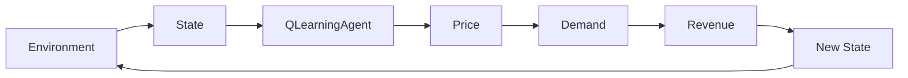

# Q-Learning Dynamic Pricing Agent

Stack: **Python · NumPy · Pandas · Gymnasium · Plotly · Streamlit · pytest**

---

## 1. System diagram

```text
Environment → State → Q-Learning Agent → Price → Demand → Revenue → New State
     ↑                                                                  |
     └────────────────────── reward / next obs ─────────────────────────┘
```


## 2. How to run

### Setup

```bash
cd rl-dynamic-pricing
python3 -m venv .venv
source .venv/bin/activate
pip install -r requirements.txt
```

### Tests

```bash
pytest -q
```

### Train

```bash
PYTHONPATH=src python scripts/train_q_learning.py --episodes 3000
```

### Evaluate + charts

```bash
PYTHONPATH=src python scripts/evaluate_q_learning.py --episodes 100
```

Outputs: `data/evaluation_summary.csv`, policy heatmap, training curve, episode traces.

### Streamlit dashboard

```bash
PYTHONPATH=src streamlit run app/streamlit_app.py
```

Controls: inventory, selling days, demand level, terminal penalty.  
Runs the trained **Q-learning** policy and shows revenue metrics + interactive charts.

### Random episode smoke test (environment only)

```bash
PYTHONPATH=src python scripts/run_random_episode.py
```

---

## Project structure

```text
rl-dynamic-pricing/
├── README.md
├── requirements.txt
├── app/streamlit_app.py
├── scripts/
│   ├── run_random_episode.py
│   ├── train_q_learning.py
│   └── evaluate_q_learning.py
├── src/
│   ├── environment/dynamic_pricing_env.py
│   ├── simulation/demand.py
│   ├── agents/q_learning_agent.py
│   ├── evaluation/
│   └── visualization/
├── models/q_learning_agent.json
├── data/                         # evaluation outputs (generated)
├── notebooks/
│   ├── 01_environment_exploration.ipynb
│   ├── 02_q_learning_analysis.ipynb
│   └── 03_q_learning_evaluation.ipynb
└── tests/
```
## 3. State space

Observation vector (normalized to `[0, 1]`, no look-ahead):

| Index | Feature | Meaning |
|------:|---------|---------|
| 0 | tickets remaining / initial inventory | Stock left |
| 1 | days remaining / selling days | Time left |
| 2 | previous price / max price | Last price charged |
| 3 | previous sales / initial inventory | Yesterday's sales |

For tabular Q-learning, inventory and time are discretized into:

- Inventory: **Low / Medium / High**
- Time: **Early / Middle / Late**

## 4. Action space

Discrete prices: **$50, $75, $100, $125, $150, $175, $200**

## 5. Reward function

Default:

```text
reward = daily revenue = price × tickets_sold
```

Optional terminal penalty (configurable, default `0`):

```text
if days == 0 and unsold > 0:
    reward -= terminal_inventory_penalty × unsold
```

## 6. Demand simulation

Poisson demand with mean:

```text
λ = base_demand × demand_level × price_factor(price) × urgency_factor(days_remaining)
```

- Higher prices generally reduce expected demand
- Randomness via Poisson sampling
- Optional urgency boost near the event
- Sales capped by remaining inventory in the environment

See [`src/simulation/demand.py`](src/simulation/demand.py).

## 7. Q-learning

Tabular Q-learning implemented **from scratch** (no deep RL library):

- Epsilon-greedy exploration
- Manual Bellman / TD update  
  `Q(s,a) ← Q(s,a) + α [ r + γ max Q(s',a') − Q(s,a) ]`
- Saved Q-table + training reward history in `models/q_learning_agent.json`

See [`src/agents/q_learning_agent.py`](src/agents/q_learning_agent.py).

## 8. Evaluation methodology

The greedy Q-learning policy is evaluated over many episodes with shared seeds (`base_seed + episode_index`).

Metrics:

- Average / median / std total revenue
- Sell-through percentage
- Average selling price
- Average unsold tickets
- Sell-out rate

## 9. Results

Default setting: **100 tickets · 20 days · demand_level=1.0 · 100 eval episodes**  
Training: **3,000 Q-learning episodes**.

| Strategy | Avg revenue | Median | Std | Sell-through | Avg price | Sell-out rate |
|----------|------------:|-------:|----:|-------------:|----------:|--------------:|
| **Q-Learning** | **~$16,758** | ~$16,812 | ~$1,037 | ~98.5% | ~$170 | ~68% |

Re-run evaluation to regenerate exact numbers and charts in [`data/`](data/).

## 10. Future improvements

- Demand models trained from public event data
- Multi-event / seat-tier extensions
