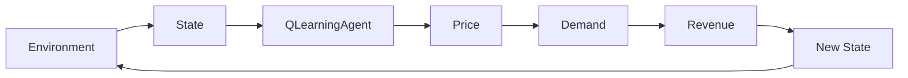

# RL Ticket Pricing

Stack: **Python · NumPy · Pandas · Gymnasium · Plotly · Streamlit · pytest**

---

## 1. System diagram

```text
Environment → State → Q-Learning Agent → Price → Demand → Revenue → New State
     ↑                                                                  |
     └────────────────────── reward / next obs ─────────────────────────┘
```


## 2. How to run

### Setup

```bash
cd rl-ticket-pricing
python3 -m venv .venv
source .venv/bin/activate
pip install -r requirements.txt
PYTHONPATH=src streamlit run app/streamlit_app.py
```

Change inventory, selling days, and demand level, then watch price, inventory, and cumulative revenue evolve over a simulated selling season.

---

## How it works

```text
Environment → State → Q-Learning Agent → Price → Demand → Revenue → New State
```

Each day, the agent observes the market, chooses a ticket price, customers respond (with randomness), revenue is collected, and the season continues until tickets sell out or the event date arrives.

### State

Normalized features (no future / look-ahead information):


| Feature           | Meaning               |
| ----------------- | --------------------- |
| Tickets remaining | Inventory pressure    |
| Days remaining    | Time pressure         |
| Previous price    | Last pricing decision |
| Previous sales    | Recent demand signal  |


For tabular Q-learning, inventory and time are binned into **Low / Medium / High** and **Early / Middle / Late**.

### Actions

Discrete prices: **$50 · $75 · $100 · $125 · $150 · $175 · $200**

### Reward

```text
reward = daily revenue = price × tickets sold
```

Optional terminal penalty for unsold inventory at the event date (configurable).

### Demand model

Customer demand is simulated with a Poisson process whose expected value falls as price rises and can rise slightly as the event approaches. Sales are always capped by remaining inventory.

Details: `[src/simulation/demand.py](src/simulation/demand.py)`

---

## Q-learning approach

Q-learning is implemented from scratch so the learning process stays easy to inspect:

- **Q-table** stores the estimated value of each (state, price) pair  
- **Epsilon-greedy** balances trying new prices vs using the best-known price  
- **Bellman update:**  
`Q(s,a) ← Q(s,a) + α [ r + γ max Q(s',a') − Q(s,a) ]`

Trained model: `[models/q_learning_agent.json](models/q_learning_agent.json)`  
Agent code: `[src/agents/q_learning_agent.py](src/agents/q_learning_agent.py)`

---

## Results

**Setup:** 100 tickets · 20 selling days · 3,000 training episodes · 100 evaluation episodes


| Metric            | Q-Learning   |
| ----------------- | ------------ |
| Avg total revenue | **~$16,758** |
| Median revenue    | ~$16,812     |
| Avg sell-through  | ~98.5%       |
| Avg selling price | ~$170        |
| Sell-out rate     | ~68%         |


### What the agent learned

- Holds **higher prices** when inventory is comfortable  
- Lowers prices when many tickets remain late in the window  
- Optimizes for **revenue quality**, not just selling every ticket

The policy heatmap (`data/policy_heatmap.html`) shows preferred price by inventory × time remaining.

> Demand is synthetic. These results show how the agent behaves in the simulator — they are not claims about a live ticketing market.

Regenerate metrics and charts:

```bash
PYTHONPATH=src python scripts/evaluate_q_learning.py --episodes 100
```

---

## Structure

```text
rl-ticket-pricing/
├── app/streamlit_app.py          # Interactive demo
├── scripts/
│   ├── train_q_learning.py       # Train the agent
│   ├── evaluate_q_learning.py    # Metrics + charts
│   └── run_random_episode.py     # Environment smoke test
├── src/
│   ├── environment/              # Custom Gymnasium env
│   ├── simulation/               # Demand model
│   ├── agents/                   # Q-learning from scratch
│   ├── evaluation/               # Metrics & episode runner
│   └── visualization/            # Plotly charts
├── models/q_learning_agent.json  # Trained Q-table
├── notebooks/                    # Exploration & analysis
└── tests/                        # Environment, demand, agent tests
```

---

## Quick start

```bash
cd rl-ticket-pricing
python3 -m venv .venv
source .venv/bin/activate
pip install -r requirements.txt

# Verify
pytest -q

# Train (optional — a trained model is already included)
PYTHONPATH=src python scripts/train_q_learning.py --episodes 3000

# Evaluate
PYTHONPATH=src python scripts/evaluate_q_learning.py --episodes 100

# Demo
PYTHONPATH=src streamlit run app/streamlit_app.py
```
## 3. State space

Observation vector (normalized to `[0, 1]`, no look-ahead):

| Index | Feature | Meaning |
|------:|---------|---------|
| 0 | tickets remaining / initial inventory | Stock left |
| 1 | days remaining / selling days | Time left |
| 2 | previous price / max price | Last price charged |
| 3 | previous sales / initial inventory | Yesterday's sales |

For tabular Q-learning, inventory and time are discretized into:

- Inventory: **Low / Medium / High**
- Time: **Early / Middle / Late**

## 4. Action space

Discrete prices: **$50, $75, $100, $125, $150, $175, $200**

## 5. Reward function

Default:

```text
reward = daily revenue = price × tickets_sold
```

Optional terminal penalty (configurable, default `0`):

```text
if days == 0 and unsold > 0:
    reward -= terminal_inventory_penalty × unsold
```

## 6. Demand simulation

Poisson demand with mean:

```text
λ = base_demand × demand_level × price_factor(price) × urgency_factor(days_remaining)
```

- Higher prices generally reduce expected demand
- Randomness via Poisson sampling
- Optional urgency boost near the event
- Sales capped by remaining inventory in the environment

See [`src/simulation/demand.py`](src/simulation/demand.py).

## 7. Q-learning

Tabular Q-learning implemented **from scratch** (no deep RL library):

- Epsilon-greedy exploration
- Manual Bellman / TD update  
  `Q(s,a) ← Q(s,a) + α [ r + γ max Q(s',a') − Q(s,a) ]`
- Saved Q-table + training reward history in `models/q_learning_agent.json`

See [`src/agents/q_learning_agent.py`](src/agents/q_learning_agent.py).

## 8. Evaluation methodology

The greedy Q-learning policy is evaluated over many episodes with shared seeds (`base_seed + episode_index`).

Metrics:

- Average / median / std total revenue
- Sell-through percentage
- Average selling price
- Average unsold tickets
- Sell-out rate

## 9. Results

Default setting: **100 tickets · 20 days · demand_level=1.0 · 100 eval episodes**  
Training: **3,000 Q-learning episodes**.

| Strategy | Avg revenue | Median | Std | Sell-through | Avg price | Sell-out rate |
|----------|------------:|-------:|----:|-------------:|----------:|--------------:|
| **Q-Learning** | **~$16,758** | ~$16,812 | ~$1,037 | ~98.5% | ~$170 | ~68% |

Re-run evaluation to regenerate exact numbers and charts in [`data/`](data/).

## 10. Future improvements

- Demand models trained from public event data
- Multi-event / seat-tier extensions
After evaluation, open charts in `data/`:

- `q_learning_training.html` — learning curve  
- `policy_heatmap.html` — learned pricing policy  
- `price_over_time.html` / `inventory_over_time.html` / `cumulative_revenue.html`

---

## Limitations

- Synthetic demand (not fitted to real sales data)
- Simplified customer behavior
- Discrete prices and coarse state bins
- Single event / single product

---

## Next steps

- Find a better source for training data  
- Try a finer state representation or deep RL (e.g. DQN)  
- Extend to multi-tier seating or multi-event inventory  
- Move from discrete price levels to continuous pricing  

